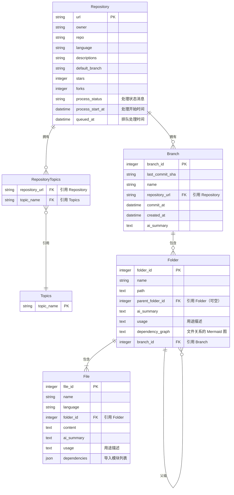

# 1. 用例

## 1.1 分析 GitHub 仓库

**参与者：** 系统、用户（按请求）

**目标：** 自动生成 GitHub 仓库的综合摘要和分析，包括其用途、结构和核心功能。这应该在遵守 GitHub API 速率限制并考虑潜在预算约束的情况下完成。

**触发条件：** 请求分析特定的 GitHub 仓库（用户明确请求或由其他事件触发）。

**基本流程：**

1. **获取仓库元数据：** 系统从 GitHub 检索仓库的基本信息（所有者、名称、描述等）。
2. **检查现有分析：** 系统验证数据库中是否已存在该仓库的最新分析。如果存在且分析被认为是最新的，则跳转到查看仓库 Wiki。
3. **处理速率限制（初始检查）：** 系统检查其当前与 GitHub API 的速率限制状态。如果接近限制，可能会延迟进一步请求或根据可用预算进行优先级排序（参见子用例 1.2）。
4. **获取仓库文件树：** 系统在遵守速率限制的情况下检索仓库内文件和目录的层次结构。
5. **使用 LLM 和 RAG 分析：** 系统使用带有 RAG 的 LLM 处理检索到的数据，以理解仓库的代码和结构。
6. **存储分析：** 生成的分析（包括摘要和关键信息）与仓库关联存储，并附上时间戳。

**后置条件：**

- 生成并存储仓库的详细分析，可能会根据速率限制或预算有所限制。
- 该分析可用于创建用户友好的 wiki 页面。

**异常情况：**

- **无效的仓库/用户：** 提供的 GitHub URL 或用户无效或不存在。
    - 系统通知用户无法找到仓库或用户。
- **GitHub API 速率限制超出：** 系统已超过对 GitHub API 的允许请求数。
    - 系统将暂停分析，并在速率限制重置后的指定时间恢复。记录错误日志。
- **预算约束：** 由于预算考虑（例如，限制获取的文件数量或分析深度）而限制分析。
    - 如果达到分析仓库的预算限制（LLM 成本、数据库成本等），系统将不进行分析。

## 1.2 查看仓库 Wiki

**参与者：** 系统、用户

**目标：** 允许用户查看特定 GitHub 仓库的生成的 wiki 页面。

**触发条件：** 用户请求查看仓库的 wiki。

**基本流程：**

1. **检索 Wiki 数据：** 系统检查请求的仓库是否存在分析（wiki）。
2. **生成 Wiki（如需要）：** 如果不存在 wiki，则触发"分析 GitHub 仓库"用例。如果预算不允许，则生成错误日志。
3. **显示 Wiki：** 系统以可读格式向用户展示 wiki 信息。代码将像画布一样显示（类似 OpenAI 的画布功能），并通过高亮逐步解释代码库。

**后置条件：**

- 用户可以查看仓库的综合概述，包括其用途、结构和关键功能。

**异常情况：**

- **无可用 Wiki 数据：** 请求的仓库没有可用的分析数据，系统由于预算限制或其他错误无法生成。
    - 系统通知用户没有可用的 wiki，如果预算允许，可能建议分析该仓库。
- **速率限制阻止 Wiki 生成：** 由于 GitHub API 速率限制，系统当前无法分析仓库以生成 wiki。
    - 系统通知用户并建议稍后再试。

# 2. 代码摘要工作流程

## 2.1 爬取 GitHub 仓库信息

通过提供仓库所有者和仓库名称来检索仓库信息

### 2.1.1 需要获取的信息：

- owner.login（所有者名称）
- name
- html_url
- language
- description
- stargazers_count（星标数）
- forks
- default_branch

### 2.1.2 示例

https://api.github.com/repos/octocat/Hello-World

```json
{
  "name": "Hello-World",
  "full_name": "octocat/Hello-World",
  "owner": {
    "login": "octocat"
  },
  "html_url": "https://github.com/octocat/Hello-World",
  "description": "My first repository on GitHub!",
  "stargazers_count": 2769,
  "pushed_at": "2024-08-20T23:54:42Z",
  "topics": [

  ],
  "forks": 2499,
  "default_branch": "master"
}
```

## 2.2 爬取仓库文件树

通过提供仓库所有者、仓库名称和提交哈希来检索给定仓库的文件树。

### 2.2.1 需要获取的信息：

- path
- files
- subdirectories

### 2.2.2 示例

https://api.github.com/repos/Octocat/Hello-World/contents?ref=7fd1a60b01f91b314f59955a4e4d4e80d8edf11d

```json
[
  {
    "name": "README",
    "path": "README",
    "sha": "980a0d5f19a64b4b30a87d4206aade58726b60e3",
    "size": 13,
    "url": "https://api.github.com/repos/octocat/Hello-World/contents/README?ref=7fd1a60b01f91b314f59955a4e4d4e80d8edf11d",
    "html_url": "https://github.com/octocat/Hello-World/blob/7fd1a60b01f91b314f59955a4e4d4e80d8edf11d/README",
    "git_url": "https://api.github.com/repos/octocat/Hello-World/git/blobs/980a0d5f19a64b4b30a87d4206aade58726b60e3",
    "download_url": "https://raw.githubusercontent.com/octocat/Hello-World/7fd1a60b01f91b314f59955a4e4d4e80d8edf11d/README",
    "type": "file",
    "_links": {
      "self": "https://api.github.com/repos/octocat/Hello-World/contents/README?ref=7fd1a60b01f91b314f59955a4e4d4e80d8edf11d",
      "git": "https://api.github.com/repos/octocat/Hello-World/git/blobs/980a0d5f19a64b4b30a87d4206aade58726b60e3",
      "html": "https://github.com/octocat/Hello-World/blob/7fd1a60b01f91b314f59955a4e4d4e80d8edf11d/README"
    }
  }
]
```

## 2.3 爬取仓库文件（代码）

通过提供仓库所有者、仓库名称、给定提交的哈希值以及包含文件名的完整文件路径来检索仓库文件

### 2.3.1 需要获取的信息

- file（纯文本或基于文件扩展名的任何格式）

### 2.3.2 示例

https://raw.githubusercontent.com/octocat/Hello-World/7fd1a60b01f91b314f59955a4e4d4e80d8edf11d/README

```
Hello World!
```

## 2.4 使用 LLM 和 RAG 摘要信息

### 2.4.1 文档分割器

根据提供的代码分割文档。这是为了请求 LLM 为特定代码块提供正确的行号。

[如何分割代码 | 🦜️🔗 Langchain](https://js.langchain.com/docs/how_to/code_splitter)

```jsx
// 来自 https://js.langchain.com/docs/how_to/code_splitter/ 的示例
// 从
const JS_CODE = `
	function helloWorld() {
	  console.log("Hello, World!");
	}

	// Call the function
	helloWorld();
`;

// 到
[
  Document {
    pageContent: 'function helloWorld() {\n  console.log("Hello, World!");\n}',
    metadata: { loc: { lines: { from: 2, to: 4 } } }
  },
  Document {
    pageContent: "// Call the function\nhelloWorld();",
    metadata: { loc: { lines: { from: 6, to: 7 } } }
  }
]
```

### 2.4.2 提示词

强制 LLM 给出代码库的见解。

[字符串提示词模板](https://js.langchain.com/docs/concepts/prompt_templates/)

### 2.4.3 Schema

确保 LLM 以预定义的 JSON 格式输出

[使用 Langchain 和 Zod 的 Schema](https://js.langchain.com/v0.1/docs/modules/model_io/output_parsers/types/structured/)

### 2.4.4 提示词 + Schema

通过提示词给出指令，并要求 LLM 根据定义的 schema 输出。

## 2.5 文件夹摘要

在摘要所有文件后，我们将所有子文件和子文件夹的摘要提供给 LLM，再次请求摘要其职责。这将从底层到根层次递归进行。

# 3. 文件结构（核心逻辑）

- Agent（代理）
    - LLMProvider（LLM 提供者）
    - Prompt（提示词）
    - Document Splitter（文档分割器/代码分割器）
    - Schema（强制 JSON schema）
- Service（服务）
    - 递归检索文件夹和文件，并摘要内容。
- GithubRepo（GitHub 仓库）
    - File Retriever（文件检索器）
    - Repo Dataclass（仓库数据类）
- DB（数据库）
    - 检查用户给定的仓库是否存在
    - 输入创建的研究 Wiki
    - 检索数据库
    - 保存仓库到数据库

# 4. 数据库建模



## 4.1 表说明

### Repository（仓库表）

存储已分析仓库的元数据。`process_status` 字段跟踪当前处理状态，用于 SSE 状态流。

### Branch（分支表）

表示仓库的特定分支/提交。`ai_summary` 包含 LLM 生成的整个仓库概述。

### Folder（文件夹表）

分支内的层次化文件夹结构。关键字段：

- `ai_summary`：LLM 生成的文件夹用途摘要
- `usage`：该文件夹用途的简要描述
- `dependency_graph`：显示文件间关系的 Mermaid 图

### File（文件表）

包含内容和分析的单个代码文件：

- `ai_summary`：LLM 生成的文件解释
- `usage`：文件角色的简要描述
- `dependencies`：导入模块/文件的 JSON 数组

### Topics 和 RepositoryTopics（主题表）

GitHub 仓库主题/标签的多对多关系。
